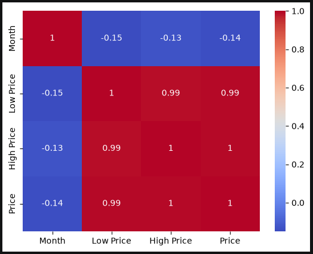

# Pumpkin Market Data Exploration

This project is part of my machine learning learning journey and is based on the **Data Science / Data Exploration** material from Microsoft's [ML for Beginners](https://github.com/microsoft/ML-For-Beginners) curriculum.

The goal of this exercise is to explore a dataset containing pumpkin prices in the United States, perform basic data preprocessing with Pandas, and visualize relationships between pumpkin prices, package sizes, and months.

> **Note:** This repository is primarily a learning and documentation project. The original dataset and learning material come from Microsoft's ML for Beginners curriculum.

---

## 📌 Objectives

Through this exercise, I practiced:

* Loading datasets with **Pandas**
* Inspecting tabular data
* Checking for missing values
* Selecting relevant columns
* Creating new calculated features
* Working with dates
* Filtering data using string conditions
* Grouping data and calculating averages
* Creating visualizations with **Matplotlib**
* Creating statistical visualizations with **Seaborn**
* Calculating correlations between numerical variables
* Creating a correlation heatmap

---

## 🗂️ Dataset

The dataset used in this exercise is:

`US-pumpkins.csv`

It contains information about pumpkin sales and prices in different parts of the United States.

The columns used in this analysis are:

| Column       | Description                                 |
| ------------ | ------------------------------------------- |
| `Package`    | Packaging/unit information for the pumpkins |
| `Low Price`  | Lower recorded price                        |
| `High Price` | Higher recorded price                       |
| `Date`       | Date associated with the recorded price     |

---

## 🔎 Data Exploration

The dataset was first loaded using Pandas:

```python
import pandas as pd

pumpkins = pd.read_csv('../data/US-pumpkins.csv')
pumpkins.head()
```

The first few rows were inspected to understand the structure of the dataset.

### Dataset Preview

[insert here]

Missing values were then checked using:

```python
pumpkins.isnull().sum()
```

### Missing Value Check

[insert here]

---

## 🧹 Selecting Relevant Data

Only the columns needed for this analysis were selected:

```python
columns_to_select = ['Package', 'Low Price', 'High Price', 'Date']
pumpkins = pumpkins.loc[:, columns_to_select]
```

This reduces the dataset to the variables relevant to the analysis.

---

## 💰 Calculating Pumpkin Price

An average price was calculated from the recorded low and high prices:

```python
price = (pumpkins['Low Price'] + pumpkins['High Price']) / 2
```

The resulting value represents an estimated average price for each record.

---

## 📅 Extracting the Month

The month was extracted from the `Date` column:

```python
month = pd.DatetimeIndex(pumpkins['Date']).month
```

This allows pumpkin prices to be compared across different months.

---

## 🧮 Creating a New DataFrame

A new DataFrame was created containing the variables needed for further analysis:

```python
new_pumpkins = pd.DataFrame({
    'Month': month,
    'Package': pumpkins['Package'],
    'Low Price': pumpkins['Low Price'],
    'High Price': pumpkins['High Price'],
    'Price': price
})
```

The resulting structure contains:

* Month
* Package
* Low Price
* High Price
* Calculated Price

---

## 📦 Package Filtering and Price Normalization

The dataset was filtered for records containing the term `bushel`:

```python
pumpkins = pumpkins[
    pumpkins['Package'].str.contains(
        'bushel',
        case=True,
        regex=True
    )
]
```

Package sizes such as `1 1/9` and `1/2` were then used to adjust the calculated price:

```python
new_pumpkins.loc[
    new_pumpkins['Package'].str.contains('1 1/9'),
    'Price'
] = price / (1 + 1/9)

new_pumpkins.loc[
    new_pumpkins['Package'].str.contains('1/2'),
    'Price'
] = price / (1/2)
```

This step demonstrates how differences in package size can affect price comparisons.

> **Learning note:** In my current notebook, the filtering of `pumpkins` occurs after `new_pumpkins` has already been created. Therefore, the filter does not modify the existing `new_pumpkins` DataFrame. This is something I identified while documenting the exercise and is an area I can improve in a later revision.

---

# 📊 Data Visualization

## Scatter Plot

A scatter plot was created to visualize the relationship between price and month:

```python
import matplotlib.pyplot as plt

price = new_pumpkins.Price
month = new_pumpkins.Month

plt.scatter(price, month)
plt.show()
```

### Output

[insert here]

---

## Monthly Average Pumpkin Price

The average price for each month was calculated and displayed as a bar chart:

```python
new_pumpkins.groupby(['Month'])['Price'].mean().plot(kind='bar')
plt.ylabel("Pumpkin Price")
```

### Output

[insert here]

---

## Seaborn Visualizations

I also experimented with Seaborn to create several different visualizations.

### Relationship Plot

```python
import seaborn as sns

sns.relplot(
    x="Price",
    y="Month",
    data=new_pumpkins
)
```

[insert here]

### Line Plot

```python
sns.relplot(
    x="Price",
    y="Month",
    kind="line",
    data=new_pumpkins
)
```

[insert here]

### Bar Plot

```python
sns.catplot(
    x="Month",
    y="Price",
    data=new_pumpkins,
    kind="bar"
)
```

[insert here]

---

# 🔗 Correlation Analysis

The correlation between the numerical variables was calculated using Pandas:

```python
correlations = new_pumpkins[
    ['Month', 'Low Price', 'High Price', 'Price']
].corr()
```

The resulting correlation matrix was visualized using a Seaborn heatmap:

```python
sns.heatmap(
    correlations,
    annot=True,
    cmap="coolwarm"
)
```

### Correlation Heatmap



The heatmap provides a visual way to identify relationships between the numerical variables.

---

# 🛠️ Technologies Used

* **Python**
* **Jupyter Notebook**
* **Pandas** — data loading, manipulation and analysis
* **Matplotlib** — basic data visualization
* **Seaborn** — statistical data visualization

---

# 📚 What I Learned

This exercise helped me understand the early stages of a typical machine learning/data science workflow.

In particular, I practiced:

1. Loading real-world data
2. Inspecting and understanding a dataset
3. Identifying missing values
4. Selecting useful features
5. Creating derived variables
6. Working with dates
7. Filtering and transforming data
8. Grouping data to find averages
9. Visualizing patterns
10. Using correlation to investigate relationships between variables

This exercise also helped me understand that **data preprocessing and exploration are important steps before building a machine learning model**.

---

#  Files

```text
02-Data-exploration/
│
├── README.md
├── pumpkin-data-exploration.ipynb
├── US-pumpkins.csv
│   
└── images/
    └── [optional screenshots]
```

---

#  Source

This exercise is based on Microsoft's **ML for Beginners** curriculum:

* [Microsoft ML for Beginners](https://github.com/microsoft/ML-For-Beginners)

The dataset and educational material are used for learning purposes.

---

##  Next Steps

Possible improvements and extensions to this project include:

* Correcting the order of the package filtering and DataFrame creation
* Cleaning and standardizing package-size information
* Investigating price differences between regions
* Exploring seasonal price patterns
* Performing additional statistical analysis
* Using the cleaned dataset as preparation for a machine learning model

---

**Status:** Completed as part of my machine learning learning journey.
